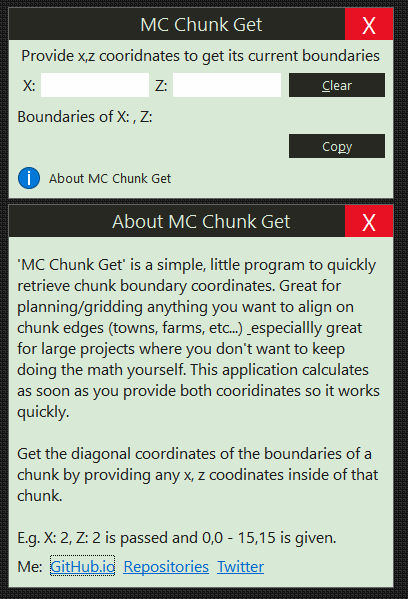

# MC Chunk Get

    

Get coordinate boundaries of a chunk by providing any x, z coordinates inside of that chunk in **Minecraft**.

## Usage

This application was written in the **[AutoHotkey](https://www.autohotkey.com/)[1](#note1)** scripting language &amp; can be run in 2 ways:

1. The provided '.ahk' file is an **AutoHotkey** script &amp; can be executed with the AutoHotkey.exe program which can be installed locally or as a portable program.

    - If **AutoHotkey** is installed or .ahk files are associated with the portable executable then you should be able to just run the .ahk file like any other executable.

    - If **AutoHotkey** is portable and .ahk files are not associated with .ahk files then you have to run the .ahk file by passing the .ahk file to the AutoHotkey.exe as a parameter.

1. There are 2 stand alone compiled exectuables in the 'compiled' directory which do not need **AutoHotkey** to be installed.

    - You can compile this yourself with AHK's - Ahk2Exe.exe provided with the program.

### Preview

Quick video preview: [MCG on YouTube](https://youtu.be/i3xKssy0QyM)

## Installation

This is a portable application &amp; can be placed anywhere you put your portables.

### Files

#### Main

[MC Chunk Get V1 32Bit [Compiled]](https://github.com/Lateralus138/MC-Chunk-Get/releases/download/1.2.9.20/mc_chunk_get_v1_32bit.exe)

[MC Chunk Get V1 64Bit [Compiled]](https://github.com/Lateralus138/MC-Chunk-Get/releases/download/1.2.9.20/mc_chunk_get_v1_64bit.exe)

[Release - Git Page](https://lateralus138.github.io/MC-Chunk-Get)

[Release - All Files](https://github.com/Lateralus138/MC-Chunk-Get/releases)

#### To Compile

[Main .ahk file](mc_chunk_get.compile.ahk)

### Notes

<a name="note1">
1: AutoHotkey - A full featured Windows scripting language with hotkey &amp; gui support &amp; focus on automation.
</a>

## License

[License File](LICENSE)

>This program is free software: you can redistribute it and/or modify it under the terms of the GNU General Public License as published by the Free Software Foundation, either version 3 of the License, or (at your option) any later version. 

>This program is distributed in the hope that it will be useful, but WITHOUT ANY WARRANTY; without even the implied warranty of MERCHANTABILITY or FITNESS FOR A PARTICULAR PURPOSE.  See the GNU General Public License for more details.
